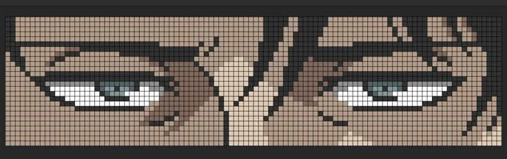

# Hi 👋, I'm Anuj Meena

### Web Application Developer

`Java` • `SQL` • `JDBC` • `Servlets` • `JSP`

### `Just Code Nig`

Building projects, learning backend development, and improving my DSA skills.

---

## >_ About Me

Computer Science student focused on Java and web application development.

Currently working with Java, SQL, JDBC, Servlets and JSP, while improving my backend development and DSA skills through projects and practice.

I enjoy learning by building projects and improving my problem-solving skills.

 

---

## 🤝 Connect

---

## 💻 Tech Stack

---

## 📊 GitHub Stats

---

### Thanks for visiting my profile 👋

